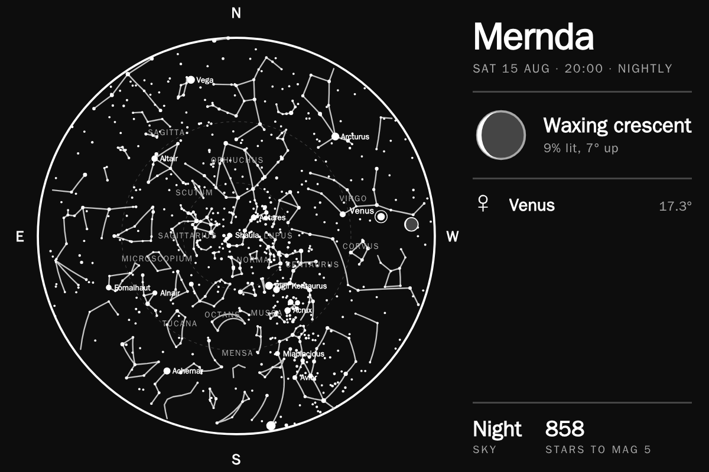
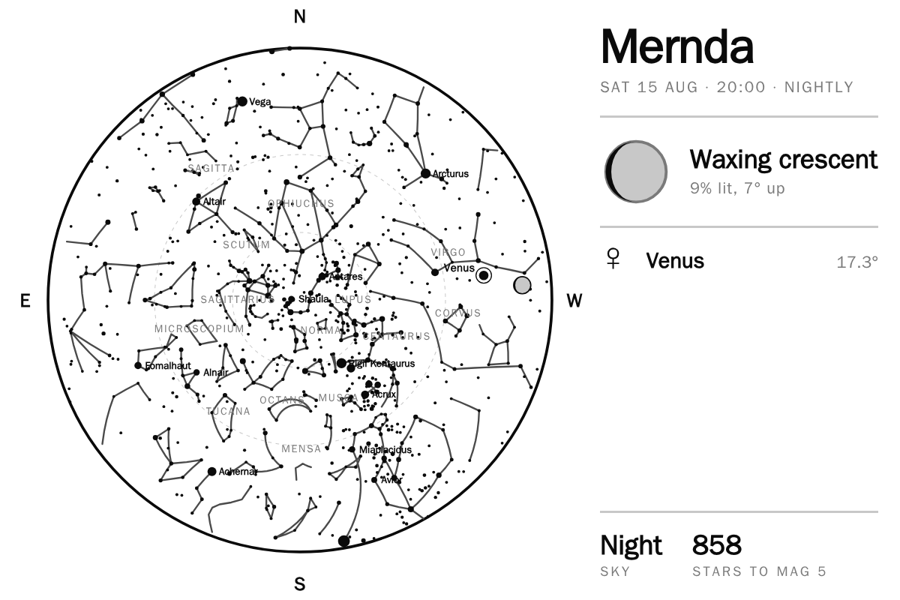
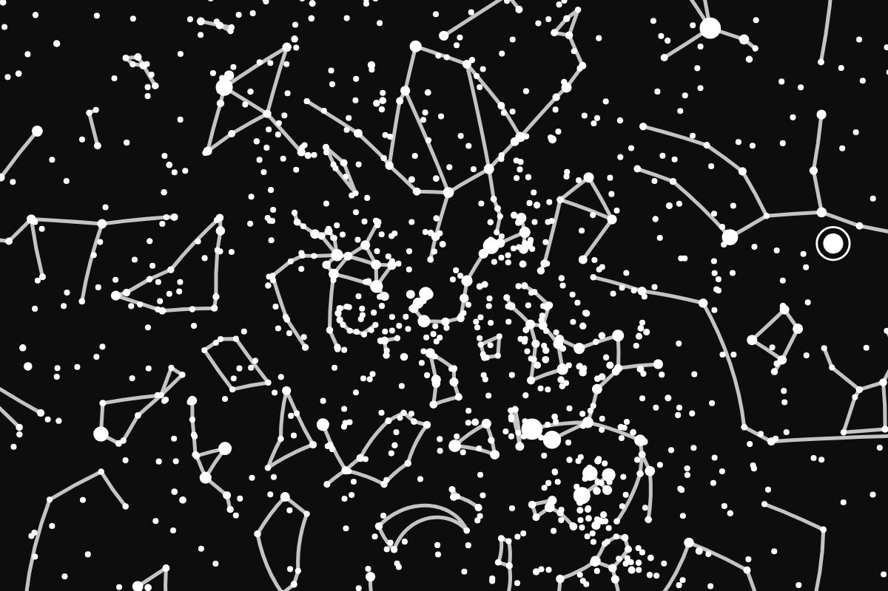
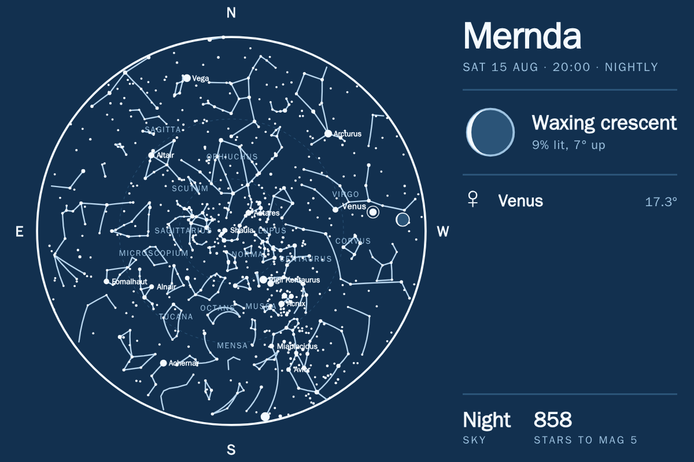

# sky_tonight

An all-sky chart of what is actually above you: five thousand stars, the
constellation figures, the planets, and the Moon with its real phase.

## No key, no network

There is no API behind this. The star catalogue is baked into the widget and
every position is computed on the spot, so it works on a panel with no internet
and costs nothing to run. `requires` is empty and `needs_network` is false.

The catalogue is HYG down to magnitude 6.0 — 5,070 stars — packed five bytes
each and compressed to 33 kB. Constellation figures come from d3-celestial.
Positions are Schlyter's method, checked against JPL Horizons: the Sun and
planets land within 1.5 arcminutes and the Moon within 2, which is far finer
than a chart a few hundred pixels across can draw.

## What it shows

Centre is straight up, the rim is the horizon, north is at the top and **east is
on the left** — you are looking up at the sky, not down at a map. Dashed rings
mark 30° and 60° altitude.

The readout gives the Moon's phase as a drawn glyph, the planets that are up
with their altitude, whether the sky is properly dark, and how many stars are
above the horizon.

## Three layouts

`board` is the chart with the readout beside it. `chart` is the disc on its own.
`bleed` fills the whole cell with sky and drops every label — a wallpaper rather
than an instrument.

Full bleed is not simply the chart scaled up: a circle only covers a rectangle
if its radius reaches the corners, so the horizon circle is sized to
circumscribe the cell and the visible sky is the middle of the dome.

## Built for e-ink

Star discs shrink geometrically with magnitude, which is what makes a field read
as depth instead of scattered dots — but the floor matters as much as the curve,
because below about a pixel a star dithers away to nothing. Nothing animates and
there are no images to fetch.

Three themes: `chart` is black on white and suits a greyscale panel best,
`night` is white on black, and `blueprint` is pale on deep blue.

## Options

| Option | Notes |
| --- | --- |
| Location | Whose sky to draw. Falls back to the app-level location. |
| Time | **Now** follows the real sky through the night; a fixed hour gives the same view every evening. |
| Layout | Chart and readout, chart only, or full bleed. |
| Theme | Chart, night or blueprint. |
| Faintest stars shown | Magnitude 4.0 to 6.0. Full bleed magnifies the sky, so 5.5 suits it better than the 5.0 default. |
| Constellation figures, names, star names, planets | Each can be turned off. |

## A note on time zones

A **fixed** hour is read in the panel's own time zone, which is right when the
panel and the sky are in the same place — the normal case. Pointing a fixed hour
at a location in another zone will be offset by the difference between them.
**Now** is an instant and is correct anywhere, though the time printed in the
readout is still the panel's local time.

## Southern skies

The Moon is drawn lit on the left below the equator and on the right above it,
because the whole sky is effectively turned over. It is the sort of thing no
amount of arithmetic catches — only looking out of the window.

## Licence

AGPL-3.0. See [LICENSE](LICENSE). Star data from the
[HYG database](https://github.com/astronexus/HYG-Database); constellation
figures from [d3-celestial](https://github.com/ofrohn/d3-celestial).
